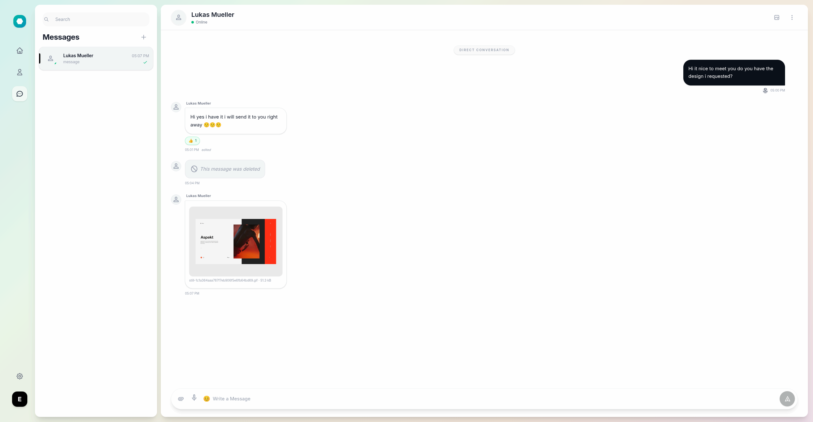
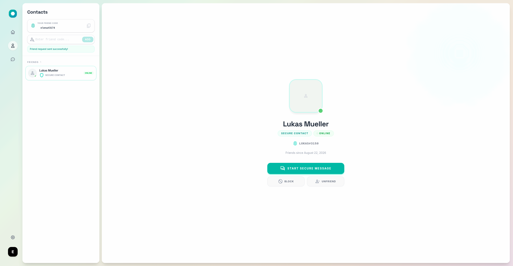
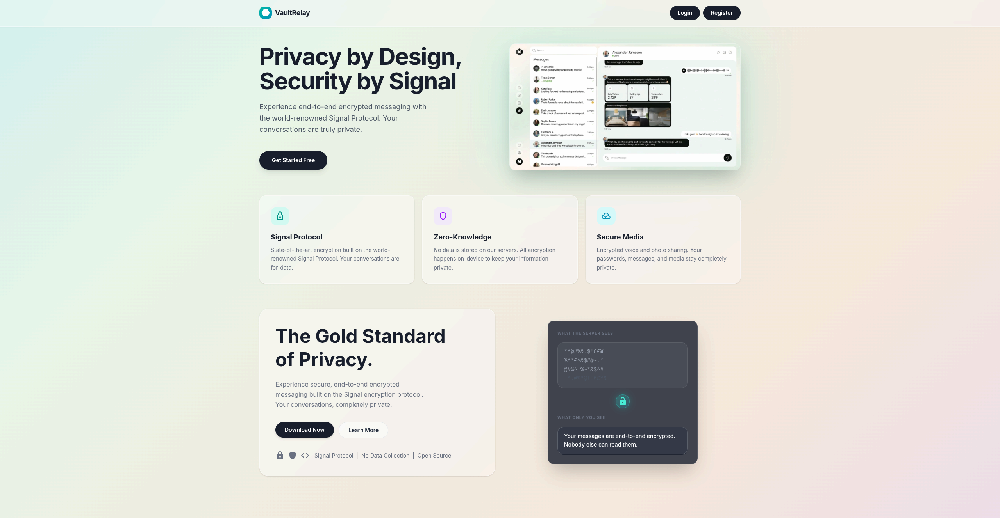
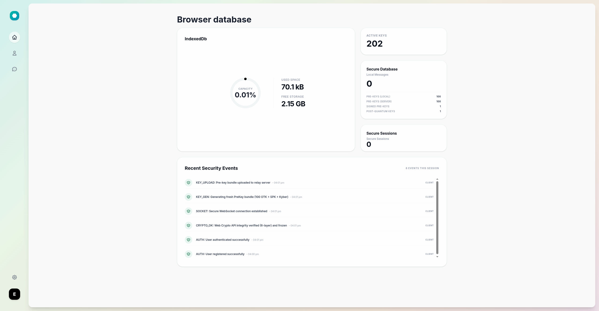
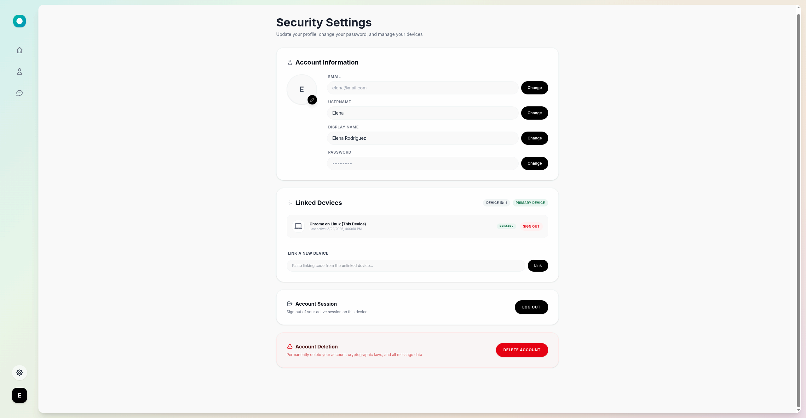
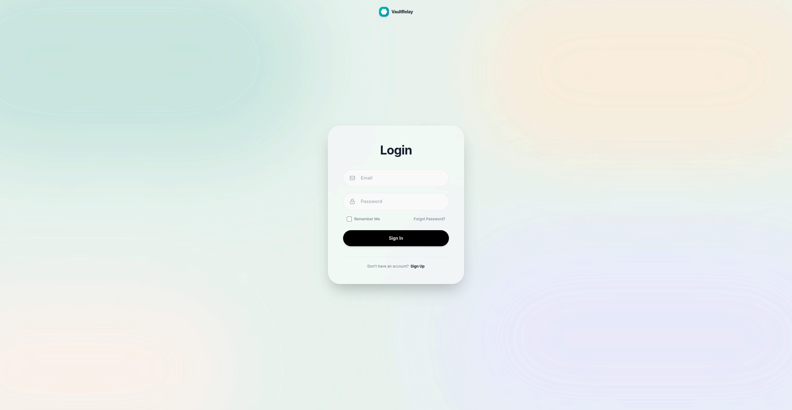
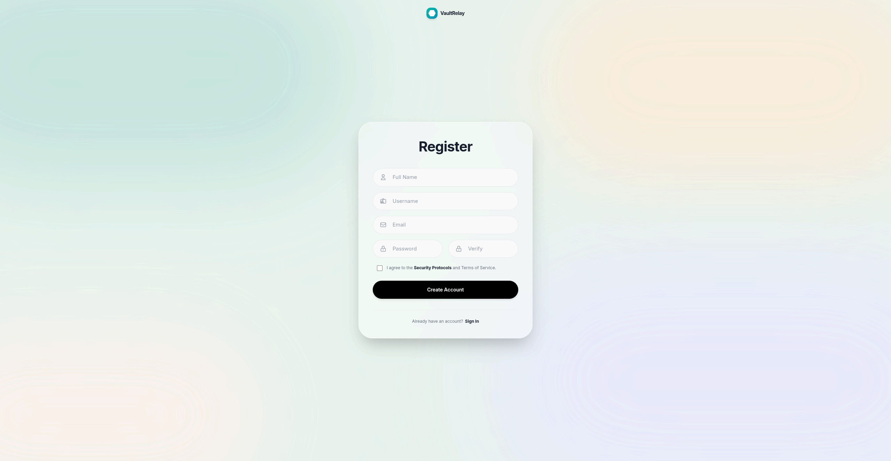
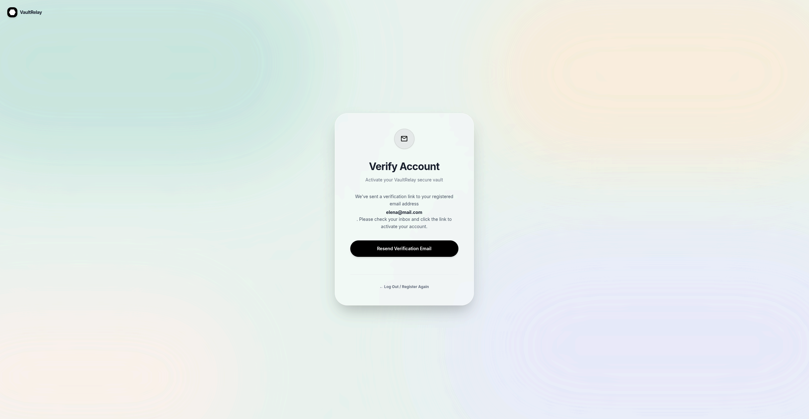
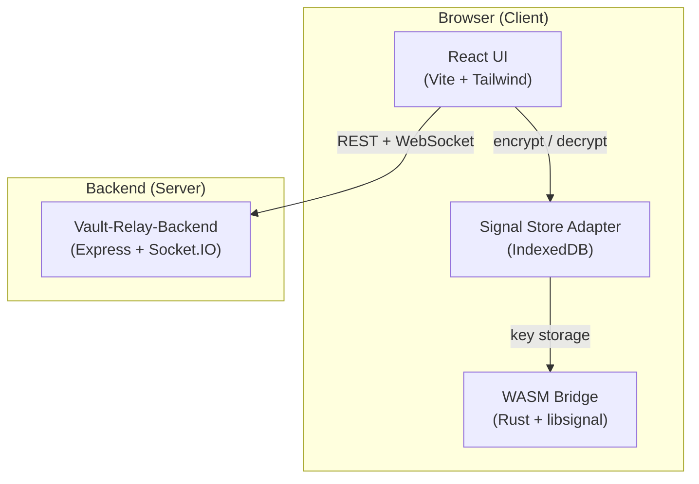

# VaultRelay Client Side

An end to end encrypted messaging application built with the **Signal Protocol**. Messages are encrypted on the sender's device and can only be decrypted by the intended recipient, the server never has access to plaintext content.

This monorepo contains the **React frontend** and the **Rust → WebAssembly bridge** that uses Signal Protocol cryptography for a end to end ecnrypted web application.

> **Status:** In active development. Most functionality works, only a few edge cases and polish are missing.

---

## Screenshots

<p align="center">
  
</p>

<details open>
  <summary><b>Click to view all pages & components</b></summary>
  <br/>

  | Direct Chat | Contacts & Requests |
  | :---: | :---: |
  |  |  |

  | Landing Page | Browser Database (IndexedDB) |
  | :---: | :---: |
  |  |  |

  | Profile & Linked Devices | Login Page |
  | :---: | :---: |
  |  |  |

  | Registration Page | Account Verification |
  | :---: | :---: |
  |  |  |

</details>

---

## Architecture Overview


### Encryption Flow

1. **Key Generation:** On first registration, the WASM bridge generates an X25519 identity key pair, signed pre keys, one time pre keys, and a Kyber 1024 post quantum pre key all stored locally in encrypted IndexedDB.
2. **Session Establishment:** When starting a conversation, the sender fetches the recipient's pre key bundle from the server and processes it through libsignal's X3DH (Extended Triple Diffie Hellman) key agreement with PQXDH (Post Quantum Extended Diffie Hellman) via Kyber.
3. **Message Encryption:** Each message is encrypted using the Double Ratchet algorithm, providing forward secrecy.
4. **Group Encryption:** Group messages use Signal's Sender Key protocol each member distributes a sender key, and messages are encrypted once for the entire group.
5. **Attachment Encryption:** Files and images are encrypted client side with AES 256 GCM before upload to S3/MinIO. The encryption key is embedded in the encrypted message payload, never exposed to the server.

---

## Tech Stack

### Frontend (`vault-relay-frontend/`)

| Layer | Technology | Version |
|---|---|---|
| **Framework** | React | 19.x |
| **Build Tool** | Vite | 8.x |
| **Routing** | React Router DOM | 7.x |
| **Styling** | Tailwind CSS | 4.x |
| **Real time** | Socket.IO Client | 4.x |
| **Testing** | Vitest + Testing Library | 4.x |
| **Crypto** | Signal Protocol via WASM | — |
| **Local Storage** | IndexedDB (Encrypted per-user databases) | — |

### WASM Bridge (`signal-wasm-bridge/`)

| Layer | Technology |
|---|---|
| **Language** | Rust (2024 edition) |
| **Signal Impl** | `libsignal protocol` + `libsignal core` |
| **WASM Tooling** | `wasm bindgen` + `wasm bindgen futures` |
| **Post Quantum** | Kyber-1024 (via libsignal KEM) |
| **Serialization** | `serde` + `base64` |
| **Build** | `wasm pack` → produces `pkg/` consumed by Vite |

### Signal Protocol Library (`libsignal/`)

A local fork of Signal's official [`libsignal`](https://github.com/nicoulaj/libsignal) Rust crate. Only the `rust/protocol` and `rust/core` sub crates are used.

---

## Project Structure

```
VaultRelayClientSide/
├── docs/                                    # Soon to come: Documentation and UI screenshots
│   └── screenshots/
├── libsignal/                               # Signal Protocol Rust library (submodule)
│   └── rust/
│       ├── protocol/                        # Core protocol implementation
│       └── core/                            # Shared types and primitives
│
├── signal-wasm-bridge/                      # Rust → WASM bridge
│   ├── src/
│   │   ├── lib.rs                           # WASM exports (encrypt, decrypt, key gen)
│   │   └── store.rs                         # JS ↔ Rust store bridge (IndexedDB calls)
│   ├── pkg/                                 # Built WASM package (npm linked)
│   ├── tests/                               # Native Rust unit tests
│   └── Cargo.toml 
│
└── vault-relay-frontend/                    # React application
    ├── src/
    │   ├── components/
    │   │   ├── Messages/                    # Chat UI (bubbles, composer, attachments, reactions)
    │   │   ├── Contacts/                    # Friend list, requests, blocking
    │   │   ├── Settings/                    # Linked devices management
    │   │   └── Shared/                      # Protected routes, toast notifications
    │   ├── contexts/
    │   │   ├── AuthContext.jsx              # Authentication state, login/logout/register
    │   │   └── ToastContext.jsx             # Global notification toasts
    │   ├── hooks/
    │   │   ├── useMessages.js               # Message loading, caching, real time updates
    │   │   ├── useConversations.js          # Conversation list management
    │   │   ├── useSignalSession.js          # 1:1 Signal session management
    │   │   ├── useGroupSignalSession.js     # Group Signal session management
    │   │   ├── useFriends.js                # Friend list, requests, real time events
    │   │   ├── messageProcessing.js         # Decryption pipeline for incoming messages
    │   │   ├── messageSending.js            # Encryption + sending pipeline
    │   │   ├── reactionSending.js           # Encrypted emoji reactions
    │   │   ├── messageActions.js            # Edit, delete, reply actions
    │   │   ├── useChatLock.js               # Per conversation password lock
    │   │   └── useMessagePage.js            # Page level message orchestration
    │   ├── lib/
    │   │   ├── signal/
    │   │   │   ├── SignalStoreAdapter.js    # IndexedDB store for Signal keys & sessions
    │   │   │   ├── initWasm.js              # WASM module initialization
    │   │   │   ├── provisioning.js          # Multi device key provisioning
    │   │   │   ├── signalUtils.js           # Protocol address helpers
    │   │   │   └── verifyCryptoIntegrity.js # Startup self test for crypto
    │   │   ├── crypto/
    │   │   │   └── attachmentCrypto.js      # AES 256 GCM file encryption/decryption
    │   │   └── eventLog.js                  # Debug event logging
    │   ├── pages/
    │   │   ├── Home.jsx                     # Landing page
    │   │   ├── Login.jsx                    # Login with email/password
    │   │   ├── Register.jsx                 # Account registration
    │   │   ├── Messages.jsx                 # Main messaging view
    │   │   ├── Contacts.jsx                 # Contacts & friend management
    │   │   ├── UserSetting.jsx              # Profile, email, password, devices
    │   │   ├── StorageInfo.jsx              # Signal key vault inspection
    │   │   ├── ForgotPassword.jsx           # Password reset request
    │   │   ├── ResetPassword.jsx            # Password reset form
    │   │   ├── VerifyEmail.jsx              # Email change verification
    │   │   ├── VerifyAccount.jsx            # New account email verification
    │   │   └── CheckEmail.jsx               # Post registration email prompt
    │   ├── services/
    │   │   ├── authService.js               # Auth API calls (login, register, tokens)
    │   │   ├── chatService.js               # Conversations, messages, friends API
    │   │   └── socketClient.js              # Socket.IO client wrapper
    │   ├── styles/                          # Global CSS
    │   └── utils/                           # Shared utilities
    ├── index.html
    ├── vite.config.js
    └── package.json
```

---

## Features

### Messaging
- **End to end encrypted 1:1 messaging** — Signal Protocol (X3DH + Double Ratchet)
- **End to end encrypted group messaging** — Signal Sender Key protocol
- **Post quantum key exchange** — Kyber 1024 (PQXDH)
- **Encrypted file & photo sharing** — AES 256 GCM client side encryption before upload
- **Message editing & deletion** — with real time sync across participants
- **Reply threading** — reply to specific messages in a conversation
- **Emoji reactions** — encrypted reactions on messages
- **Read receipts** — delivered and read indicators
- **Typing indicators** — real time typing status
- **Message search** — search through decrypted message history

### Contacts
- **Friend codes** — unique friend code system for adding contacts
- **Friend requests** — send, accept, decline, cancel with realtime notifications
- **User blocking** — block/unblock users with messaging disabled
- **Online presence** — real time online/offline/away status

### Security
- **Per user IndexedDB databases** — encrypted signal storage <userId> db per user for Signal keys and sessions.
- **Multi device support** — up to 5 linked devices per account
- **Device management** — view, promote, unlink devices
- **Per chat password lock** — optional password protection per conversation
- **Crypto integrity self test** — automatic verification on startup
- **httpOnly cookie auth** — JWT access + refresh tokens in secure cookies

### Account
- **Email verification** — required before first login
- **Password reset** — email based reset flow
- **Email change** — verified email change with token
- **Avatar upload** — profile pictures via S3/MinIO pre signed URLs
- **Account deletion** — full data wipe including Signal keys

---

## Prerequisites

| Tool                   | Version |             Purpose                |
|------------------------|---------|------------------------------------|
| **Node.js**            | ≥ 18    | Frontend dev server                |
| **npm**                | ≥ 9     | Package management                 |
| **Rust**               | ≥ 1.70  | WASM bridge compilation            |
| **wasm pack**          | ≥ 0.12  | Rust → WASM build tool             |
| **Vault Relay Backend**| —       | Backend API server (separate repo) |

---

## Local Development Setup

### 1. Clone the Repository

```bash
git clone https://github.com/your-org/VaultRelayClientSide.git
cd VaultRelayClientSide
```

### 2. Build the WASM Bridge

```bash
cd signal-wasm-bridge

# Install wasm-pack if not already installed
cargo install wasm-pack

# Build the WASM package (output goes to pkg/)
wasm-pack build --target web --out-dir pkg
```

This produces a `pkg/` directory that the frontend references as a local npm dependency (`"signal-wasm-bridge": "file:../signal-wasm-bridge/pkg"`).

### 3. Install Frontend Dependencies

```bash
cd ../vault-relay-frontend
npm install
```

### 4. Start the Development Server

```bash
npm run dev
```

The Vite dev server starts at `http://localhost:5173` with:
- **API Proxy:** `/api/*` → `http://localhost:4000` (backend)
- **WebSocket Proxy:** `/socket.io` → `http://localhost:4000` (backend)

> **Important:** The [Vault-Relay-Backend](https://github.com/your-org/Vault-Relay-Backend) must be running on port 4000 for the app to function. See the backend README for setup instructions.

### 5. Run Tests

```bash
# Run all tests
npm test

# Watch mode
npm run test:watch
```

---

## Building for Production

```bash
cd vault-relay-frontend
npm run build
```

Output is generated in `vault-relay-frontend/dist/`. This can be served by any static file server or CDN. In production, configure your reverse proxy (nginx, Caddy, etc.) to:
- Serve the `dist/` directory for all frontend routes
- Proxy `/api/*` to the backend
- Proxy `/socket.io` to the backend (with WebSocket upgrade)

---

## How the Signal Integration Works

### IndexedDB Storage (`SignalStoreAdapter`)

Each user gets an isolated IndexedDB database named `signal-storage-<userId>`. This stores:

| Store | Contents |
|---|---|
| `identityKeys` | Local identity key pair + remote identity keys |
| `sessions` | Active Signal sessions with other users |
| `preKeys` | One time pre keys (consumed on first message) |
| `signedPreKeys` | Signed pre keys (rotated periodically) |
| `kyberPreKeys` | Kyber 1024 post quantum pre keys |
| `senderKeys` | Group sender keys for each group member |
| `deviceMeta` | Local device ID, primary status |
| `chatLocks` | Per conversation password hashes |
| `messages` | Cached decrypted messages for offline access |

### WASM Bridge API

The `signal-wasm-bridge` Rust crate exposes these key APIs to JavaScript:

| Function | Purpose |
|---|---|
| `initIdentity()` | Generate or load identity key pair + registration ID |
| `generatePreKeys(start, count)` | Generate batch of one time pre keys |
| `generateSignedPreKey(identity, id)` | Generate a signed pre key |
| `generateKyberPreKey(identity, id)` | Generate a Kyber 1024 pre key |
| `SessionBuilder.processPreKeyBundleWithKyber(...)` | Establish a new session via X3DH + PQXDH |
| `SessionCipher.encrypt(plaintext)` | Encrypt a message for a 1:1 session |
| `SessionCipher.decrypt(type, ciphertext)` | Decrypt a received message |
| `GroupSessionBuilder.createSenderKeyDistributionMessage(...)` | Create group key distribution |
| `GroupSessionBuilder.processSenderKeyDistributionMessage(...)` | Process received group key |
| `GroupCipher.encrypt(distributionId, plaintext)` | Encrypt for group |
| `GroupCipher.decrypt(ciphertext)` | Decrypt group message |

---

## License

This project is a personal project to expand on my expirience in building secure communication applications.